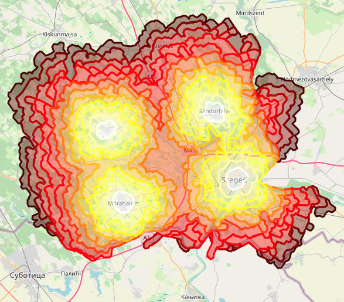
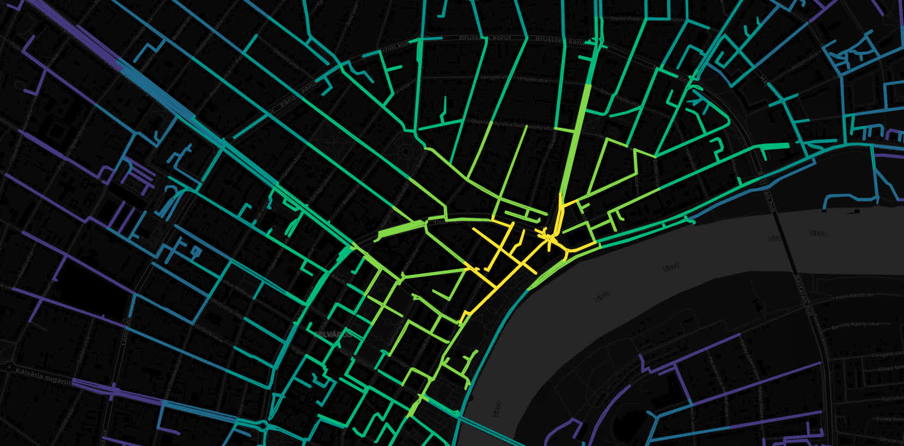

# Multiple Source Isochrone Map Generator
Create your own isochrone maps fast with the buffered roads method from OpenStreetMap road networks.
## Results

<!--  -->




## Obtain your own graph
There are two ways you can procure a graph.
### First way
Run the `Python` code in `osmnx_getmap.py`. Change `source_coord` to the coordinate of interest, dist to change the network size, network type to `'bike'` or `'driving'`.
```python
import osmnx as ox
ox.config(log_console=True)

source_coord = (20.148722, 46.252382)
G = ox.graph_from_point(source_coord, dist=100, network_type='bike')
ox.save_graphml(G, 'out.graphml')

```
This uses the internet to download the graph.
File `out.graphml` is ready to be used.

### Second way
Download a map from the website of [GeoFabrik](https://download.geofabrik.de/) in `.osm.pbf` extension (e.g. `someplace.osm.pbf`).
Copy the coordinates of a polygon in a text file (e.g. `poly.txt`) in the way presented in [osmosis wiki](https://wiki.openstreetmap.org/wiki/Osmosis/Polygon_Filter_File_Format) and save.
Run the following command.
```
osmosis -verbose --read-pbf file=someplace.osm.pbf --bounding-polygon file=poly.txt
completeWays=yes --tf accept-ways highway=* --tf reject-ways highway=footway
--tf reject-relations --used-node --write-xml file=extract.osm
```
See more details of `osmosis` [here](https://wiki.openstreetmap.org/wiki/Osmosis/Detailed_Usage_0.41).
If the polygon stretches beyond multiple territories consider using the `merge` over multiple `.osm.pbf` files.
Run the `Python` code in `osm2graph.py` where `extract.osm` is the file created by `osmosis`:
```python
import osmnx as ox
G = ox.graph_from_xml('extract.osm', bidirectional=True)
ox.save_graphml(G, 'out.graphml')
```
File `out.graphml` is ready to be used.

## Compute the isochrones
The program is designed to be faster than `networkx`/ `shapely` in `Python`. It makes use of various boost libraries for fast computation: *Boost Graph Library* for graph algorithms, *Boost Polygon Library* for unary union of polygons, *Boost Geometry* for buffering polygons, *Boost Program Options* for parsing command line arguments.
Compile `isochrones.cpp` with
```
g++ -std=c++11 isochrones.cpp -o isoch -O3 -L /usr/lib/x86_64-linux-gnu/ -lboost_graph -lboost_program_options
```
> note that the location of the lib files might differ from /usr/lib/x86_64-linux-gnu/

When running the program make sure you have the source points in a WKT Linestring in a text file.
### Isochrones with filled interior
Run with `--fill` on e.g.
```
./isoch --simplify 0 --travel-speed 20 --radii 5 10 15 20 25 30 35 40 45 50 55 60 --circle-points 11 --verbose --subtract --buffer-distance 0.005 --fill --input-file in.graphml
```

### Isochrones without filled interior
Run with `--fill` off e.g.
```
./isoch --simplify 0 --travel-speed 20 --radii 5 10 15 20 25 30 35 40 45 50 55 60 --circle-points 11 --verbose --subtract --buffer-distance 0.00006 --input-file out.graphml
```

### Isochrones of the shortest distance tree
Run with `--predecessor` on e.g.
```
./isoch --simplify 0 --travel-speed 20 --radii 1 2 3 4 5 6 --circle-points 11 --verbose --subtract --buffer-distance 0.00002 --input-file out.graphml --predecessor
```

## Visualisation
We use `folium` in `Python` to create the maps. Just run `python3 iso_folium.py`.
